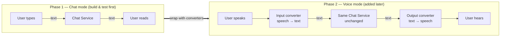
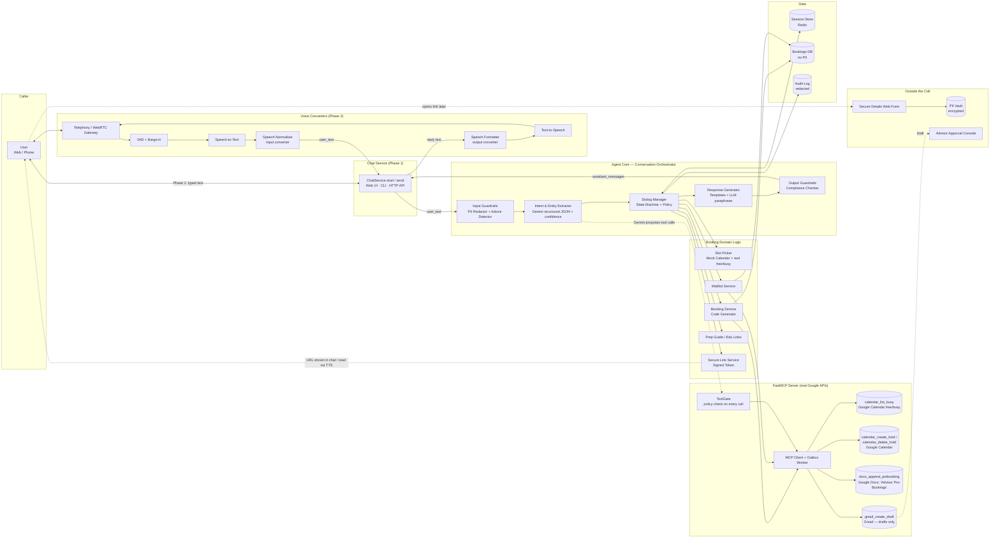
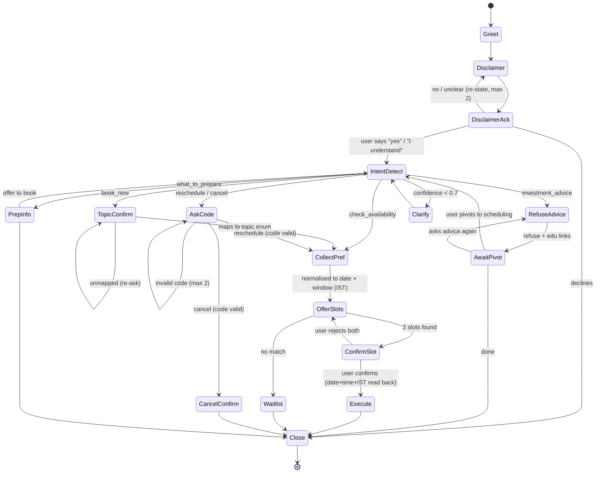
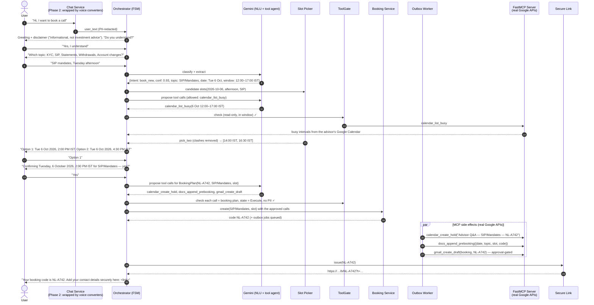

# Architecture — Voice Agent: Advisor Appointment Scheduler

> Source docs: [`decription.md`](./decription.md), [`problemstatement.md`](./problemstatement.md) · Low-level design: [`low-level-architecture.md`](./low-level-architecture.md)

## 1. Goals & Non-Goals

**Goals**
- Book, reschedule, or cancel a **tentative** advisor slot by voice (built and validated **chat-first**, see §2).
- Support 5 intents: `book_new`, `reschedule`, `cancel`, `what_to_prepare`, `check_availability`.
- Orchestrate side effects through **MCP**: Calendar hold, Notes/Doc append, Email draft (approval-gated).
- Enforce compliance: **no PII on the call**, mandatory disclaimer, refuse investment advice, IST time zone stated and date/time repeated on confirm.
- Hand the caller a **booking code** (e.g. `NL-A742`) and a **secure link** to submit contact details outside the call.

**Non-Goals**
- Giving any financial or investment advice.
- Capturing identity, phone, email, or account numbers by voice.
- Auto-sending emails (all emails are drafts until a human approves them).

---

## 2. Development Method: Chat First, Then Voice

> **Plan:** first build a **chat app** that does **all the operations** (intents, slot offers, booking codes, calendar hold, Docs entry, Gmail draft, secure link) and returns its output **as chat messages**. Test everything in text. **Later**, convert **chat input → voice input** (speech-to-text) and **chat output → voice output** (text-to-speech). The chat app itself does not change.



**Rules of the method**
1. **The Chat Service is the product.** Every business operation and compliance rule lives behind one text contract: `send(session_id, user_text) → reply(messages[], state, booking_code?, secure_url?)`.
2. **Chat output is final.** Each reply is complete, plain, readable text (full date, time and `IST`, booking code, link). Voice mode reads these same strings, so behaviour can't drift between modes.
3. **Voice is a converter, not a feature.** The input converter turns audio into the text a user would have typed. The output converter turns reply text into audio (spelling the code, expanding "IST", replacing the URL with spoken instructions). Neither one decides anything about the conversation.
4. **Zero core changes in Phase 2.** The orchestrator, NLU, guardrails, domain and MCP code are frozen when voice work starts. Any voice need that seems to require a core change is solved in the converters, or else it's treated as a gap in the chat contract and fixed there first.
5. **Same tests, two modes.** Phase 1 records chat conversation scripts as golden transcripts. Phase 2 replays the same scripts as speech and expects the **same Chat Service replies**.

## 3. Logical Architecture (Layers)

**Build order:** implement everything **below the dashed line** using **chat** (text in → text out) first. Add the voice converters **above** the line only after the chat path is complete and passing tests. The core never knows whether the input came from a keyboard or a microphone.

```
┌──────────────────────────────────────────────────────────────────────────┐
│ Voice converters (Phase 2):                                              │
│   Input:  telephony / WebRTC → VAD → STT → speech normaliser → text      │
│   Output: text → speech formatter (spell code, IST, link) → TTS → audio  │
└────────────────────────────────────┬─────────────────────────────────────┘
                                     │ text only (same contract as typing)
┌────────────────────────────────────▼─────────────────────────────────────┐
│ Chat Service (Phase 1): ChatService.start / send                         │
│   front ends: web chat UI, CLI, HTTP message API                         │
└────────────────────────────────────┬─────────────────────────────────────┘
                                     │ user_text / assistant_messages
 - - - - - - - - - - - - - - - - - - ┼ - - - - - - - - - - - - - - - - - - -
┌────────────────────────────────────▼─────────────────────────────────────┐
│ Conversation orchestrator (state machine + policy)  — channel-agnostic   │
│  • Intent routing (5 intents)                                            │
│  • Slot collection & validation                                          │
│  • Compliance gates (disclaimer ack, PII block, advice refusal)          │
└──────────┬───────────────────────┬──────────────────────┬────────────────┘
           ▼                       ▼                      ▼
┌────────────────────┐ ┌──────────────────────┐ ┌────────────────────────────┐
│ NLU / LLM          │ │ Booking domain logic │ │ FastMCP server (own, real  │
│ (Gemini via Google │ │ • Topic enum         │ │ Google APIs — no mocks)    │
│  Python SDK)       │ │ • Slot picker        │ │ • calendar_list_busy       │
│ • classify         │ │ • Booking codes      │ │ • calendar_create_hold /   │
│ • extract entities │ │ • IST display        │ │   calendar_delete_hold     │
│ • propose MCP tool │ │ • Waitlist           │ │ • docs_append_prebooking   │
│   calls            │ │                      │ │ • gmail_create_draft       │
└─────────┬──────────┘ └──────────────────────┘ └──────────────▲─────────────┘
          │  proposed calls    ┌───────────────────────────┐   │ approved calls only
          └───────────────────►│ ToolGate (deterministic)  ├───┘
                               └───────────────────────────┘
```

**Principle:** the orchestrator owns turn-taking and the legal/compliance transitions. The LLM helps with understanding and natural phrasing, and the Gemini agent **proposes** the real Google MCP tool calls, but every call passes a deterministic **ToolGate** first. The LLM **cannot bypass policy** (e.g. it cannot skip the disclaimer, accept PII, or write to Calendar/Docs/Gmail before the user's explicit "yes").

### Phases
| Phase | Scope | Exit criteria |
|---|---|---|
| **1 — Chat** | Chat Service + chat front ends + orchestrator + NLU + domain + FastMCP tools + secure link: **all operations, end to end, in text** | All 5 intents, waitlist, and guardrail scenarios pass as text conversation tests; real Google Calendar hold, Docs line and Gmail draft are produced from chat by the Gemini agent calling our FastMCP tools (no mock backends; CI replays recorded Google responses); golden transcripts recorded |
| **2 — Voice** | Input converter (VAD + STT + speech normaliser) and output converter (speech formatter + TTS) wrapping the **unchanged** Chat Service | The same golden scripts replayed as speech give the same Chat Service replies; booking code spelled out; latency targets met; **no diff** in core packages |

---

## 4. Deployment View (target, after Phase 2)



---

## 5. Components

### 5.1 Chat Service (Phase 1) — the product
- **One contract** used by every front end:
  - `ChatService.start() → ChatReply` (greeting + disclaimer)
  - `ChatService.send(session_id, user_text) → ChatReply`
  - `ChatReply = {messages[], state, booking_code?, secure_url?, quick_replies[], done}`
- The Chat Service performs **all operations**: intent handling, slot offers, booking codes, enqueueing the calendar hold, Docs append and Gmail draft through FastMCP, and issuing the secure link. Its output is complete chat text.
- Front ends (all thin): a CLI REPL (for development and tests), a minimal web chat UI, and the HTTP API `POST /v1/sessions/{id}/messages`.
- Messages are written as **plain, self-contained sentences**: no tables, the full date and time with `IST`, and an explicit booking code and link. They read well on screen and can be spoken as-is by the Phase 2 output converter. Markdown is limited to **bold**, which the converter strips.
- `quick_replies` (e.g. `yes`, `Option 1`, topic names) are only a convenience for chat UIs. Each one is exactly the text a user could type or say, so voice needs nothing extra.

### 5.2 Voice Converters (Phase 2) — wrap the Chat Service
| Converter | Component | Responsibility | Example options |
|---|---|---|---|
| Transport | Telephony / WebRTC gateway | Carries audio in and out (phone or browser) | Twilio Media Streams, Daily, SmallWebRTC |
| **Input** (speech → chat text) | VAD | Detects end of user turn; triggers barge-in | Silero VAD |
| | STT | Streams audio into a transcript; tuned for Indian-English accents | Google Speech-to-Text, Deepgram |
| | Speech normaliser | Fixes STT quirks so the text looks like what a user would type ("two thirty pm" → "2:30 pm", "N L A seven four two" → `NL-A742`); maps silence and low confidence onto normal chat text (`repeat`, `stop`) | custom |
| **Output** (chat text → speech) | Speech formatter | Turns `ChatReply.messages` into speakable SSML: strips markdown, spells the booking code twice, says "India Standard Time", and replaces the URL with spoken instructions | custom |
| | TTS | Low-latency streaming voice output | Google Cloud TTS, ElevenLabs |

The converters call the **same** `ChatService.send()` that the chat UI uses (in-process, or over the HTTP API). They hold **no booking logic and no compliance logic**. Voice pipeline framework: **Pipecat** (or LiveKit Agents) wires up VAD → STT → normaliser → ChatService → formatter → TTS.

### 5.3 Agent Core (Conversation Orchestrator)
- **Input guardrails** (run before the LLM and before any logging)
  - **PII redactor:** regex + NER for phone numbers, emails, PAN, Aadhaar, account or folio numbers, and long digit strings. On a hit, the input is masked and the user gets a polite deflection: *"Please don't share personal details here; you'll get a secure link for that."*
  - **Investment-advice detector:** keywords + intent classification for requests like "should I buy…", "which fund…", or "returns". On a hit, the agent refuses and offers **educational links**.
- **Intent & entity extractor (hybrid routing):**
  1. A lightweight **rule/keyword classifier** handles obvious cases cheaply ("cancel", "reschedule", a spoken booking code).
  2. Otherwise **Gemini** (via the Google Python SDK) returns constrained JSON: `{intent, confidence, topic, day_pref, time_pref, booking_code, confirmation, ack}`.
  3. If `confidence < 0.7`, or required entities are missing or invalid, the orchestrator asks a **clarification prompt** instead of guessing.
- **Dialog manager:** a deterministic **finite-state machine + policy**. It owns turn-taking and all legal/compliance transitions. The LLM classifies, extracts, paraphrases and **proposes MCP tool calls**; it **cannot** skip the disclaimer, accept PII, or confirm a booking.
- **Gemini tool agent:** the FastMCP tool list is discovered at startup and given to Gemini as function declarations (automatic function calling disabled). Gemini proposes calls such as `calendar_list_busy` while offering slots, and `calendar_create_hold` + `docs_append_prebooking` + `gmail_create_draft` after the user's "yes". The **ToolGate** approves a call only if the tool is allowed in the current state, write tools come after the explicit confirmation, the arguments equal the deterministic booking plan (code, topic, IST slot), and there is no PII. A rejected or missing proposal falls back to the orchestrator calling the same tools directly, so the outcome never depends on the LLM.
- **Response generator:** compliance-critical lines (disclaimer, confirmation read-back, booking code, refusal) come from **fixed templates**. Small talk may be LLM-paraphrased.
- **Output guardrails:** a final check that the response contains no advice language and no echoed PII, and that confirmations include "IST" plus the full date and time.

### 5.4 Booking Domain Logic
| Service | Key functions |
|---|---|
| **Topic enum** | `KYC/Onboarding`, `SIP/Mandates`, `Statements/Tax Docs`, `Withdrawals & Timelines`, `Account Changes/Nominee`. Free text must map to one of these (or the agent asks again). |
| **Preference normaliser** | Turns natural language ("next Tuesday evening") into `{date, time_window}` in **IST**. Stored and displayed with the time zone, always. |
| **Slot picker** | `find_slots(date, window, topic) → [slot]` against a mock calendar (JSON/DB) of advisor availability, as the brief requires. Candidates that clash with a busy interval from the **real** advisor Google Calendar (`calendar_list_busy`) are dropped. Returns exactly **two** concrete options. Stored in UTC, rendered in **Asia/Kolkata (IST)** with the full date and time. |
| **Booking service** | `create(topic, slot)`, `reschedule(code, new_slot)`, `cancel(code)`. Generates the code (§9). Idempotent per `session_id`. |
| **Waitlist service** | Used when no slot matches: creates a waitlist entry plus a waitlist hold and a Gmail draft, and issues a waitlist-specific code. |
| **Prep guide** | Scripted, topic-keyed content for the "what to prepare" intent (no advice), plus a curated list of educational links. |
| **Secure link service** | Issues a short-lived signed URL (`/b/{code}?t={HMAC token}`, single-use, 48h TTL) so the caller can submit contact details later. |

### 5.5 FastMCP Server (Google Workspace tools)
One **FastMCP** server (Python, our own) exposes narrowly scoped tools backed **only by the real Google APIs** (`google-api-python-client`). There are no mock or fake backends; if Google credentials are missing the server refuses to start. The Gemini agent (through the ToolGate) and the outbox worker call it as an MCP client:

| Tool | Backend | Input | Behaviour |
|---|---|---|---|
| `calendar_list_busy` | Google Calendar API (free/busy) | `{start_ist, end_ist}` | **Read-only.** Returns busy intervals on the advisor calendar so offered slots never clash with real meetings. |
| `calendar_create_hold` | Google Calendar API | `{topic, code, start_ist, end_ist, kind: booking\|waitlist}` | Creates a **tentative** event titled `Advisor Q&A — {Topic} — {Code}` (waitlist: `Advisor Q&A — Waitlist — {Topic} — {Code}`). Description has no PII. Returns `event_id`. |
| `calendar_delete_hold` | Google Calendar API | `{event_id \| code}` | Releases the hold (cancel, or the old slot on reschedule). |
| `docs_append_prebooking` | Google Docs API | `{date, topic, slot, code, status}` | Appends a row to the **"Advisor Pre-Bookings"** doc. `status` ∈ `tentative, waitlist, rescheduled, cancelled`. |
| `gmail_create_draft` | Gmail API | `{template: booking\|reschedule\|cancel\|waitlist, code, topic, slot}` | Creates an advisor-notification **draft only**. There is no `send` tool, so a human must approve and send it. |

**Reliability:** MCP calls go through a **transactional outbox**. The booking row and its outbox jobs are written in one DB transaction, and a worker runs the MCP calls with retries and idempotency keys (`{code}:{tool}`). The caller gets the booking code right away; side effects become eventually consistent and are tracked per action (`pending → done/failed`).

**Approval gate:** drafts appear in the advisor's Gmail Drafts folder (or the **Advisor Approval Console**). Only a human can send them.

**Auth:** a Google service account (domain-wide delegation) or OAuth client with the minimum scopes: `calendar.freebusy`, `calendar.events`, `documents`, and `gmail.compose`.

**Testing without fakes:** CI runs the real FastMCP server in-process (`Client(mcp)`) and replays Google responses recorded from a sandbox Workspace account. A live suite (`pytest -m google_live`) runs against the sandbox account itself.

### 5.6 Data & Post-Call
- **Session store (Redis):** dialog state, slots offered, retry counters. 30-minute TTL.
- **Bookings DB:** `code, topic, slot_start_utc, slot_end_utc, status, calendar_event_id, notes_row_id, email_draft_id, created_at`. **No PII.**
- **Audit log:** redacted transcript, state transitions, guardrail hits, MCP results.
- **Secure details web form:** the caller opens the link and enters name, email, and phone. These are stored in an **encrypted PII vault** keyed by booking code, separate from the agent.

---

## 6. Intent Model (five intents)

| Intent | Purpose | Typical outcome |
|---|---|---|
| `book_new` | New tentative booking | Full happy path, or waitlist |
| `reschedule` | Change an existing tentative slot | Look up by booking code (caller states it verbally), re-offer two slots, `calendar_delete_hold` + `calendar_create_hold`, Docs update, Gmail draft |
| `cancel` | Cancel a tentative hold | `calendar_delete_hold` + Docs update + optional Gmail draft |
| `what_to_prepare` | Pre-visit guidance | Scripted / KB content by topic; no advice |
| `check_availability` | Windows / "when can I book?" | Query the mock calendar; offer next steps toward `book_new` |

**Routing:** hybrid (rules → Gemini structured JSON) with a confidence threshold; fall back to clarification prompts when confidence is low (§5.3).

---

## 7. Dialog State Machine



**State notes**
1. **Greet:** a short value proposition (a chat message; in Phase 2 the output converter speaks the same text).
2. **Disclaimer → DisclaimerAck:** mandatory "informational, not investment advice". This needs an **explicit acknowledgment** before continuing, and no other intent is processed until it's acknowledged.
3. **IntentDetect:** if not `book_new`, branch to the reschedule / cancel / prepare / availability sub-flows (each a mini-flow).
4. **TopicConfirm:** must map to the topic enum (§5.4).
5. **CollectPref:** natural language → normalised `{date, time_window}` in **IST**.
6. **OfferSlots:** the mock calendar returns **two** concrete options, shown in chat with the full date/time + **IST**. In Phase 2 the output converter speaks the same strings.
7. **Execute (on confirm):** generate the booking code → the Gemini agent proposes `calendar_create_hold` → `docs_append_prebooking` → `gmail_create_draft` (approval-gated); the ToolGate checks each call against the booking plan before it reaches the real Google APIs through FastMCP.
8. **Close:** output the booking code and **secure URL** in chat (no PII collected in-session). In Phase 2 the output converter speaks the same reply, spells the code, and turns the URL into spoken instructions.

**Global interrupts (any state):** PII detected → deflect and stay in the current state. Advice request → `RefuseAdvice` (booking is not entered unless the user pivots to scheduling). "Repeat" → replay the last prompt. Repeated misunderstanding (3 tries) → offer the secure link and close gracefully.

---

## 8. Booking Sequence (happy path, chat mode)

The sequence below is the Phase 1 chat flow. In Phase 2 the **only** difference is that the user's lines go through the input converter (speech → the same text) and the agent's lines go through the output converter (the same text → speech). Everything between `CH` and `L` is identical.



> **Delivering the link without PII:** the Chat Service always returns the full clickable link in chat. In Phase 2 the output converter decides how to say it: in web voice the link also stays visible in the on-screen transcript; on a phone call it says a short URL plus the code (e.g. `advisor.example.com/b` + code). The user types the code on that page, which then issues the signed token.

---

## 9. Booking Code

- Format: `NL-` + 1 letter + 3 digits (e.g. `NL-A742`), drawn from a **non-ambiguous alphabet** (no `I`, `O`, `0`, `1`).
- Generated with a CSPRNG and checked for uniqueness against the DB (retry on collision).
- Shown as text in chat (`NL-A742`). In Phase 2 the output converter spells it phonetically ("N, L, A as in Apple, seven, four, two") and repeats it once. The input converter turns a spoken code back into `NL-A742`.
- Waitlist codes use a distinct prefix, e.g. `NL-W…` (final format to be aligned with the PM).

---

## 10. Alternate Flows

| Intent / case | Behaviour |
|---|---|
| **Reschedule** | Ask for the booking code (stated verbally / typed) → validate → collect a new preference → offer 2 slots → confirm → `calendar_delete_hold` (old) + `calendar_create_hold` (new), `docs_append_prebooking` with `status=rescheduled`, `gmail_create_draft(reschedule)`. |
| **Cancel** | Ask for the code → confirm → `calendar_delete_hold`, `docs_append_prebooking` with `status=cancelled`, optional `gmail_create_draft(cancel)`. |
| **What to prepare** | Ask for the topic → scripted/KB checklist (documents to keep handy, no advice) → offer to book. |
| **Check availability** | Collect a day or time window → list available windows in IST from the mock calendar → offer next steps toward `book_new`. |
| **No matching slots** | Waitlist entry → `calendar_create_hold(kind=waitlist)` → `docs_append_prebooking` with `status=waitlist` → `gmail_create_draft(waitlist)` → issue a waitlist code + secure link. |
| **Investment advice asked** | Detected by keywords or intent → fixed refusal template + **educational links only** → **do not enter booking** unless the user explicitly pivots to scheduling. |

---

## 11. Compliance & Safety Controls

| Control | Where enforced |
|---|---|
| Disclaimer shown/spoken **and explicitly acknowledged** before any other step | FSM states `Disclaimer` → `DisclaimerAck` (not skippable by the LLM) |
| No PII captured | Input guardrail redacts before the LLM, logs, or MCP; the schema has no PII fields |
| No investment advice | Keyword + intent detection, output checker, fixed refusal template; booking blocked until the user pivots |
| IST stated and date/time repeated | Slot-offer and confirmation templates; output guardrail validates them |
| Human-in-the-loop email | The FastMCP server exposes `gmail_create_draft` only (no send tool) |
| Least privilege | Minimal Google OAuth scopes per tool; calendar limited to the advisor calendar |
| LLM cannot bypass policy | The FSM owns transitions; LLM output is validated JSON. Gemini may only **propose** MCP tool calls: the ToolGate allows write tools only after the explicit "yes", requires the arguments to equal the deterministic booking plan, blocks PII, and caps calls per turn. Automatic function calling is disabled |
| Data minimisation | Redacted transcripts, 30-day retention; PII only in the vault via the secure link |

---

## 12. Suggested Tech Stack

| Layer | Choice (default) | Alternatives |
|---|---|---|
| Language / runtime | Python 3.11 + FastAPI | — |
| Chat Service + front ends (Phase 1) | `ChatService` + CLI REPL + FastAPI message API + simple web UI | Streamlit / Gradio |
| LLM / NLU | **Gemini** via the Google Python SDK (`google-genai`), structured JSON output + function calling over the FastMCP tools | — |
| MCP | **FastMCP** (Python) server + FastMCP client | Official MCP Python SDK |
| Calendar / Docs / Email | **Google Calendar, Google Docs, Gmail APIs** (`google-api-python-client`) wrapped as FastMCP tools — real APIs in every environment | Tests replay recorded Google responses; no mock backends |
| Voice converters runtime (Phase 2) | Pipecat | LiveKit Agents |
| STT / TTS (Phase 2 converters) | Google Cloud Speech-to-Text / TTS | Deepgram / ElevenLabs |
| State / DB | Redis + SQLite/Postgres | In-memory for Phase 1 |
| Observability | OpenTelemetry + structured logs | Langfuse for LLM traces |

---

## 13. Proposed Repository Layout

```
.
├── docs/
│   ├── decription.md
│   ├── problemstatement.md
│   ├── architecture.md
│   └── low-level-architecture.md
├── src/
│   ├── channels/
│   │   ├── chat/             # Phase 1: ChatService + CLI REPL, HTTP message API, web UI
│   │   └── voice/            # Phase 2: input converter (VAD, STT, speech normaliser),
│   │                         #          output converter (speech formatter, TTS), transport
│   ├── orchestrator/         # ── core: frozen once Phase 1 exits ──
│   │   ├── fsm.py            # state machine + policy (channel-agnostic)
│   │   ├── nlu.py            # rules + Gemini structured extraction, confidence
│   │   ├── guardrails/       # pii.py, advice.py, output_check.py
│   │   └── templates/        # compliance-critical chat text (plain, speakable sentences)
│   ├── domain/               # topics, preference normaliser, slot picker, codes, IST display, waitlist, prep
│   ├── mcp_server/           # FastMCP on real Google APIs: calendar_list_busy, calendar_create_hold,
│   │                         #   calendar_delete_hold, docs_append_prebooking, gmail_create_draft
│   ├── mcp_client/           # client + tool discovery, ToolGate, outbox worker
│   ├── web/                  # secure details form + approval console
│   └── storage/              # db models, session store
├── data/mock_calendar.json
└── tests/                    # FSM, guardrails, MCP contract, chat conversations + golden transcripts (replayed as voice in Phase 2)
```

**Dependency rule:** `channels/*` may import the Chat Service. The core (`orchestrator/`, `domain/`, `mcp_*`) must never import `channels/`. This is enforced in CI (import-linter), so voice code can't leak into the core.

---

## 14. Testing & Evaluation

- **Unit:** FSM transitions (including the disclaimer-ack gate and advice → pivot), PII regex/NER cases, advice classifier, intent confidence fallback, code generator uniqueness, IST normalisation and rendering.
- **Contract:** the real FastMCP server in-process with Google responses recorded from a sandbox Workspace account (no mock backends); ToolGate rules; idempotency on retries. A live suite (`pytest -m google_live`) hits the sandbox Calendar, Doc and Gmail directly.
- **Conversation evals (Phase 1, text):** scripted dialogs for all 5 intents, plus adversarial cases (user types a phone number, asks "which SIP is best?", no slots available, ambiguous intent, invalid booking code). Each passing run is saved as a **golden transcript** (user text → Chat Service replies).
- **Converter unit tests (Phase 2):** the speech normaliser (spoken codes, times, digits) and the speech formatter (code spelling, IST expansion, URL replacement, markdown stripping) are tested in isolation, text in and text out.
- **Voice evals (Phase 2):** replay the golden scripts as synthesised speech → input converter → Chat Service → output converter. Assert that the Chat Service replies **match the chat golden transcripts**, plus barge-in. Metrics: time-to-first-audio < 800 ms (rules-only NLU), turn latency, task completion rate, number of turns to book, re-prompt rate.

---

## 15. Open Questions

1. Phase 2 transport: phone (PSTN), web voice, or both? This only changes the output converter's link phrasing, not the Chat Service.
2. ~~Real Google Workspace accounts or mock backends behind the FastMCP tools?~~ **Decided:** real Google Workspace (sandbox account for development and tests) behind our own FastMCP server; no mock backends.
3. Advisor capacity model: one advisor or a pool? Slot duration (30 or 45 minutes)?
4. Waitlist code format, and whether waitlist holds go on the calendar or only in Docs (align with the PM).
5. Retention period for redacted transcripts and audit logs.
