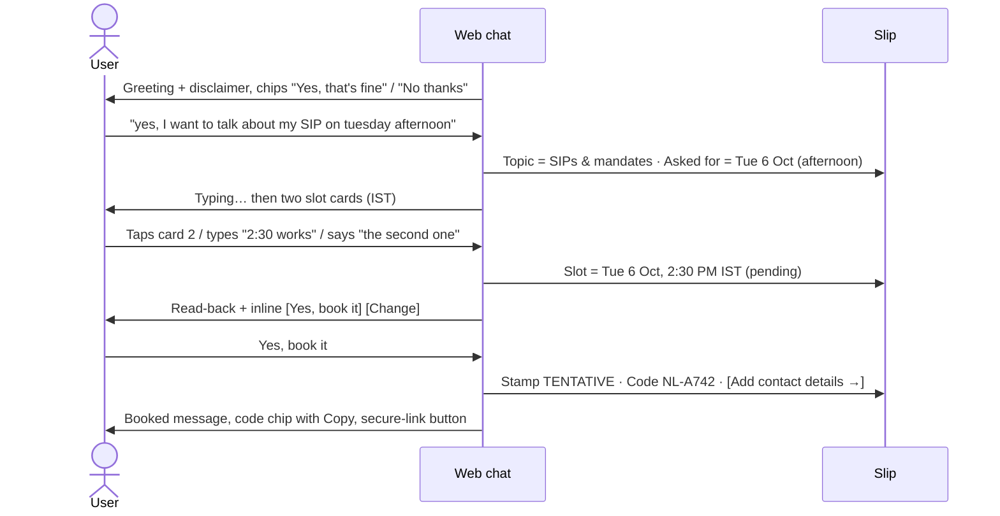
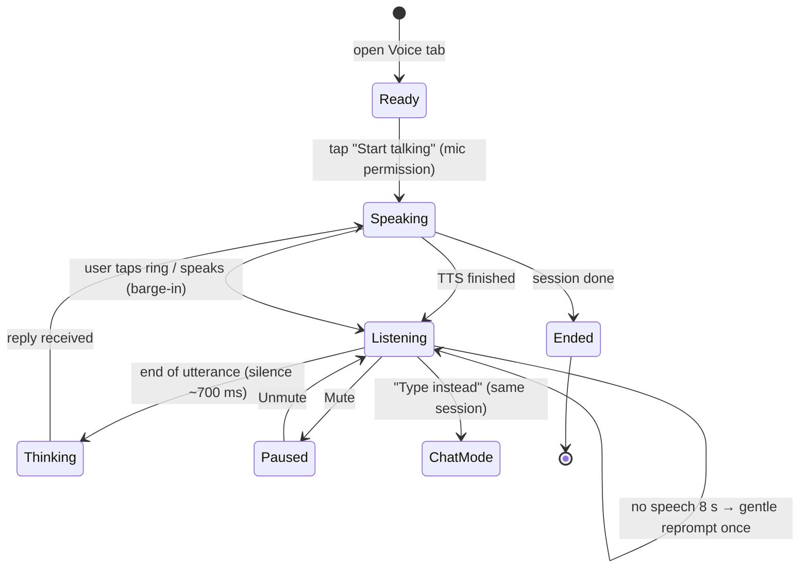

# UX design: chat and voice

Status: **implemented** in `src/advisor_agent/channels/chat/web/` (`index.html`, `styles.css`, `app.js`, `voice.js`). The flows, states and voice rules below are as built. The built UI follows the user's reference (a mobile assistant app), so its visual language is the indigo style in section 4. `docs/ux-prototype.html` is the earlier "counter slip" mockup, kept for reference only.

## 1. Why the current UI feels abrupt

| Symptom (today) | Cause | Fix in this design |
|---|---|---|
| Replies land all at once in one block | No pacing and no "agent is thinking" signal | Typing indicator, then paragraphs revealed at about 250 ms intervals, the pace of speech |
| Hard to tell where you are in the booking | Progress only lives in prose | A **pre-booking slip** that fills in live: topic, time, slot, code, contact |
| Slot offers are a sentence to parse | Slots arrive as bold text | **Slot cards** inside the message, pickable by tap, by typing "1:30 works", or by voice |
| Chips vanish, the input locks, the chat dead-ends at the end | The UI is a thin text pipe | Persistent composer, contextual suggestions, an explicit end state with "New conversation" |
| The confirmation is just another line of text | No artifact for the outcome | The slip gets stamped **TENTATIVE** with the code, a copy action and the secure-link button |
| Voice is a separate future thing | No shared model | **One session, two modes.** Switch between chat and voice mid-conversation without losing anything |

## 2. Principles

1. **The outcome is always visible.** The slip is the source of truth for the user. Prose is just the conversation around it.
2. **Every choice works in three ways:** tap, type and speak. Chips and slot cards send the same natural phrases the NLU already understands, such as "The first one" or "Yes, book it".
3. **Speech pacing in both modes.** Chat reveals sentences the way voice speaks them, so the two modes feel like one product.
4. **Compliance is calm, not loud.** The disclaimer is a single acknowledgement moment, followed by a persistent footnote. PII guidance appears where the user would type, not as a modal.
5. **IST is always on screen.** A live IST clock sits in the header, and every time shown carries "IST".

## 3. Layout

### Desktop (≥ 960 px): conversation with the slip beside it

```
┌──────────────────────────────────────────────────────────────────────────────┐
│  Advisor appointments            [ Chat | Voice ]              13:18 IST ●  │
├───────────────────────────────────────────────┬──────────────────────────────┤
│                                               │  PRE-BOOKING SLIP            │
│  ◐  Hi there! I can set up a quick, tentative │  Step 3 of 4 · Pick a time   │
│     call with one of our human advisors.      │  ─────────────────────────── │
│                                               │  Topic      SIPs & mandates  │
│                    I'd like to talk about my  │  Asked for  Tue 6 Oct, aft.  │
│                    SIP mandate on Tuesday ▸   │  Slot       —                │
│                                               │  Code       —                │
│  ◐  I've got two times open (IST):            │  Contact    after booking    │
│     ┌──────────────┐ ┌──────────────┐         │  ┄┄┄┄┄┄┄┄┄┄┄┄┄┄┄┄┄┄┄┄┄┄┄┄┄┄┄ │
│     │ TUE 6 OCT    │ │ TUE 6 OCT    │         │  No personal details here.   │
│     │ 1:00 PM IST  │ │ 2:30 PM IST  │         │  Contact details go through  │
│     └──────────────┘ └──────────────┘         │  the secure link.            │
│     Which suits you better?                   │                              │
│                                               │                              │
│  ( The first one ) ( The second one ) ( Another time )                       │
│  ┌──────────────────────────────────────┐ 🎙  ➤                              │
│  │ Message…                             │                                    │
│  └──────────────────────────────────────┘                                    │
│  Informational only — not investment advice.                                 │
└───────────────────────────────────────────────┴──────────────────────────────┘
```

### Mobile (< 960 px): the slip collapses to a sticky summary strip

```
┌───────────────────────────────┐
│ Advisor appointments  13:18 IST│
│ [ Chat | Voice ]               │
├───────────────────────────────┤
│ ▸ Step 3/4 · SIPs · Tue aft.  │  ← tap to expand the full slip (sheet)
├───────────────────────────────┤
│  conversation…                │
│  slot cards stack vertically  │
├───────────────────────────────┤
│ chips scroll horizontally →   │
│ [ Message…        ] 🎙  ➤     │
└───────────────────────────────┘
```

## 4. Visual language

### 4.0 As built: indigo assistant (supersedes the counter slip)

This follows the user's reference: soft lavender ground, white rounded cards, one indigo-blue accent and pastel icon tiles.

| Token | Value | Use |
|---|---|---|
| Ground | `#EEF0F8` → `#F7F6FC` with faint indigo/lilac radial washes | Page |
| Surface | `#FFFFFF` | Cards, tiles, agent bubbles, the ask bar |
| Ink / Ink-2 | `#10163A` / `#5A6082` | Text (Ink-2 is 5.4:1 on the ground and 6.1:1 on white) |
| Primary | `#2D4CE8`, hover `#1C35C4`, soft `#E9EDFF` | Buttons, links and focus rings |
| Gradient | `140deg #4A67FF → #2D4CE8 → #1A2FB3` | Advisor desk card, booking ticket, user bubbles, voice orb |
| Tile tints | blue, purple, rose (cancel), green, orange | Icon wells on the home actions |

- **Screens:**
  - **Home:** an IST greeting and date, the gradient "Advisor desk" card showing hours, open or closed, and bookings made on this device (code, topic and slot only, kept in `localStorage`), five action tiles, and an ask bar with send and voice buttons.
  - **Chat:**
    - White agent cards and gradient user bubbles.
    - Slot offers become tappable rows (date + time pill).
    - Confirmations become inline buttons (filled primary; red for cancel).
    - The secure link becomes an "Add contact details" button.
    - Bookings get a gradient ticket with the code and "Copy code".
    - A live booking panel (topic → preferred time → slot → code) sits beside the thread at ≥ 1060 px and collapses to a summary strip below that.
  - **Voice:** a "Voice mode" pill, a breathing orb with waveform bars, a state label (Listening… / Thinking… / Speaking — tap to interrupt / Paused), the agent caption, a live transcript (interim words lighter), and ✕ / pause / keyboard controls.
- **Shape:** 22 px card radius, 18 px tiles, pill buttons, and long low shadows.
- **Type:** system UI stack. Monospace is used only for booking codes.
- **Motion:** Messages rise in about 420 ms apart, with a typing indicator. The orb has halo rings while listening and breathes while speaking or thinking. All of this is off under `prefers-reduced-motion`.

### 4.1 Earlier proposal: the counter slip

The booking code works like a railway PNR or a bank token. Users already trust paper slips like these, so the outcome is drawn as one.

| Token | Value | Use |
|---|---|---|
| Paper | `#F3F5F1` | Page ground (cool, slightly green paper) |
| Surface | `#FFFFFF` | Slip, slot cards and composer |
| Ink | `#14231E` | Primary text (15.8:1 on paper) |
| Ink-2 | `#4A5A53` | Secondary text (6.6:1 on paper, 7.3:1 on white) |
| Rule | `#D5DDD7` | Hairlines and the perforation |
| Ledger green | `#0E6B52` | The single accent: primary actions, the selected slot, the voice ring |
| Stamp marigold | `#8A4F00` on `#FFF1D6` | Only the **TENTATIVE** stamp and waitlist status |
| Alert | `#B42318` | Errors and the PII warning |

- **Type:** the system UI stack throughout. Tabular figures for times. `ui-monospace` only for the booking code, because the code is data.
- **Scale:** 13 / 15 / 20 / 28 px. Slot times and voice captions sit at 28 px.
- **Shape:** 12 px radius on cards and 999 px on chips. The slip has a perforated top edge made with a CSS mask. No shadows except the slip, which uses `0 8px 24px -12px rgb(20 35 30 / .25)`.
- **Motion:**
  - 200 ms ease-out on state changes. Paragraph reveal is a 6 px rise plus opacity.
  - A slip row "inks in" (background flash, then fade) when it fills.
  - The stamp drops in once, at booking.
  - All of it is disabled under `prefers-reduced-motion`.

## 5. Chat user flows

### 5.1 Book new (happy path)



Rules:
- The request carry-over already works. A request typed before the disclaimer "yes" is honoured straight after it.
- Read-back always repeats the full date and time with IST. The slip shows the same string.
- After booking, the composer stays live with the suggestions "Move it", "What should I bring?" and "I'm done".

### 5.2 No matching slot, so waitlist
The slot step shows "Nothing's free for Thu (morning)". The slip turns to **WAITLIST** (marigold), shows the code, and the secure link is still offered.

### 5.3 Reschedule and cancel
1. Ask for the code. The composer placeholder becomes "Booking code, e.g. NL-A742".
2. The slip loads the existing booking: the old slot is struck through.
3. Reschedule shows new slot cards, then a read-back of "from → to", then the slip shows the new slot.
4. Cancel shows a destructive confirmation inline ("Cancel booking" in alert red, "Keep it" as secondary). The slip is then stamped **CANCELLED**.

### 5.4 What to prepare and availability
- **What to prepare:** the guide renders as a short checklist in the message. Then the suggestion chip "Book a call for this".
- **Availability:** windows render as compact day rows ("Tue 6 Oct · 1:00, 2:30 PM IST"). Tapping a row starts booking with that preference.

### 5.5 Interruptions
| Event | Treatment |
|---|---|
| Investment-advice question | A polite refusal plus education links as link chips. The slip stays where it was, and the chip "Carry on with my booking" resumes. |
| PII typed (phone or email pattern) | The message is not echoed. An inline warning sits above the composer: "Please don't share personal details — you'll get a secure link at the end." |
| Network error | Inline "Couldn't send — Retry". The text stays in the composer. |
| Session expired | "This chat timed out — starting fresh" plus the summary of the last slip, if any. |
| Calendar or MCP failure | The slip row shows "Couldn't place the hold", with a Retry chip (maps to TOOL_RETRY). |

## 6. Voice user flows

Voice is a **mode of the same session**. The slip stays on screen, so voice users see what they are agreeing to.

```
┌───────────────────────────────────────────────┬──────────────────────────────┐
│                                               │  PRE-BOOKING SLIP            │
│                   ◯◯◯                         │  (same slip, live)           │
│                 ◯  ●  ◯     ← listening ring  │                              │
│                   ◯◯◯                         │                              │
│                                               │                              │
│   "I've got two times open: Tuesday at 1 PM   │                              │
│    or 2:30 PM IST. Which suits you better?"   │                              │
│                                               │                              │
│   You: "the second one…"   (live caption)     │                              │
│                                               │                              │
│      [ ⏸ Mute ]   [ ⌨ Type instead ]   [ ✕ End ]                             │
└───────────────────────────────────────────────┴──────────────────────────────┘
```

### 6.1 Voice states



| State | Ring | Caption | Sound |
|---|---|---|---|
| Ready | Static outline | "Tap to start. You'll hear a short note first." | — |
| Speaking | Slow breathing (scale 1 → 1.04) | The agent sentence currently spoken is highlighted | TTS |
| Listening | Filled, reacts to mic level | Interim transcript in Ink-2, final in Ink | Soft start tick |
| Thinking | Rotating dashed segment | "One moment…" (after 600 ms only) | — |
| Paused | Grey | "Muted" | — |
| Error | Alert outline | "I didn't catch that — tap to try again" or "Switch to chat" | — |

### 6.2 Spoken-copy rules
These are applied by the voice adapter. The templates stay the source of truth.

- Bold markers are stripped. Times are read as "two thirty PM IST". Dates are read as "Tuesday, the sixth of October".
- **Booking code:** spelled out slowly ("N, L, A, seven, four, two") and repeated once. The slip shows it at the same time.
- **Secure link:** never read aloud. The agent says "I've put a secure link on your screen to add your contact details." The link appears on the slip.
- **Slot choice:** "the first one", "the second one", "the 2:30 one" and "neither" go through the same NLU as typed text.
- **Disclaimer:** spoken in full and needs a verbal "yes". The mic opens right after it.
- **PII spoken:** the transcript is redacted before display ("•••"). The PII_DEFLECT copy is spoken.

### 6.3 Latency budget (target, Phase 7)
| Step | Budget |
|---|---|
| End-of-speech detection | 500–700 ms |
| STT final | ≤ 300 ms |
| Orchestrator and NLU | ≤ 800 ms (Gemini) / ≤ 50 ms (rules) |
| TTS first audio | ≤ 400 ms (streamed) |
| **Turn gap (user stops → agent starts)** | **≤ 2.0 s**; a "thinking" earcon if over 1.2 s |

## 7. API needs for this design

The UI should not parse prose. One additive, backward-compatible field on `ChatReply` is proposed. It holds no PII and is excluded from golden records:

```json
"details": {
  "flow": "book",
  "topic": "SIP/Mandates",
  "preference": "Tuesday, 6 October 2026 (afternoon)",
  "offered": ["Tuesday, 6 October 2026, 1:00 PM IST", "Tuesday, 6 October 2026, 2:30 PM IST"],
  "slot": null,
  "current_slot": null,
  "waitlist": false
}
```

The voice phase adds `POST /v1/sessions/{id}/audio` (STT then the same `send()`) and `GET /v1/tts?text=…` (or a streamed TTS URL per message). Both are thin adapters over the existing chat service.

## 8. Accessibility
- The conversation log is `aria-live="polite"`. Slip changes are announced once ("Slot added: Tuesday 2:30 PM IST").
- Every chip and slot card is a real `<button>` with a visible focus ring (2 px ledger green, 2 px offset). The keyboard order is log, then suggestions, then composer.
- Voice mode always offers **Type instead**, and captions are always on.
- Tap targets are at least 44 px. Text is at least 15 px. Contrast meets AA.

## 9. Implementation plan (steps 1–3 done)
1. Add the `details` field to `ChatReply`, with tests (backend, additive).
2. Rebuild `channels/chat/web/`: slip, slot cards, pacing, states, mobile sheet.
3. Build the voice-mode UI behind a `VoiceEngine` interface (`listen()`, `speak()`, `stop()`). Phase 7 plugs in Google Cloud STT/TTS or ElevenLabs. A browser Web Speech preview can stand in for demos.
